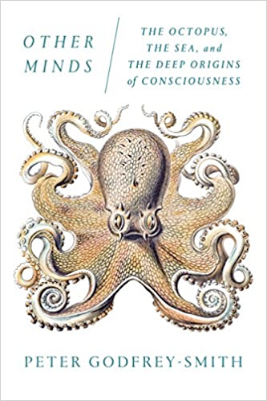
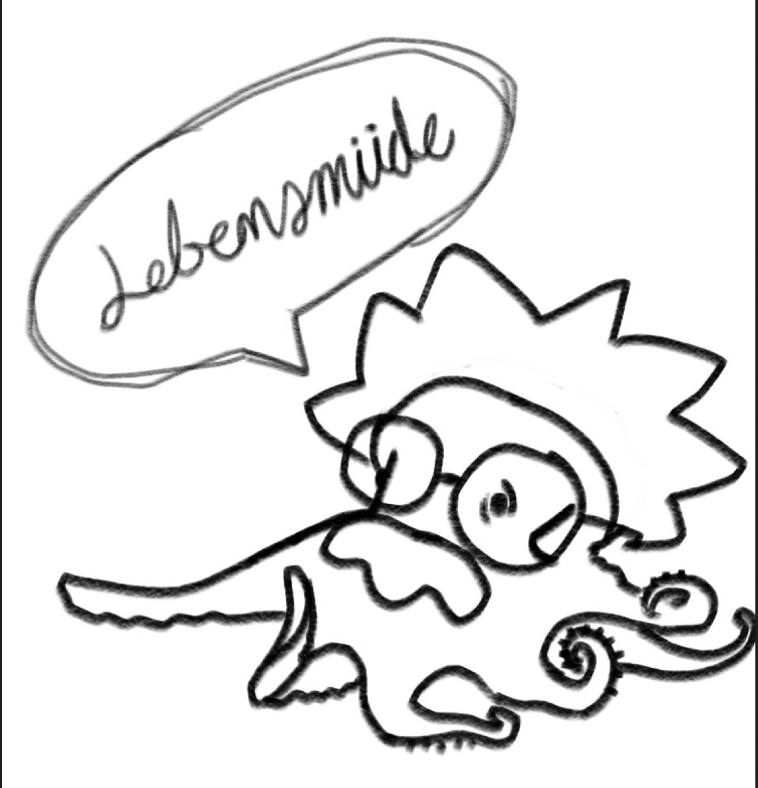

# Other Minds: The Octopus, the Sea, and the Deep Origins of Consciousness

Other Minds: The Octopus, the Sea, and the Deep Origins of Consciousness by the biologist and philosopher Peter Godfrey-Smith takes his curiosity about the behaviour of the octopuses as a starting point to explore the origin of intelligence and consciousness in the animal kingdom, comparing the evolution of different species as the cephalopods, the mammals and birds.

The book starts with an evolutionary description of the octopus brain and presents some experiments to try to show that there exists a relationship with the human brain, even though it is interesting to read about these experiments, no conclusions are draft from them, suddenly, the author starts a discussion about the language and its relation with consciousness and thinking, to me this part of the book is very disconnected from the previous topics.

My favourite part is the description of the ability of the octopuses and other cephalopods to change their skin colour. This part presents various theories which help to understand the evolutionary objective of this ability, the discussion becomes better as we discover that the octopuses are likely colourblind.

In the last part, there is a section about aging, some theories about the evolutionary reasons why we die, and the short lifespan of the octopuses. The final chapter is about how Octopolis, a place where the octopuses get together, is an uncommon phenomenon, given that the octopuses tend not to be in communities.

The book is far for being perfect at some parts, we can find very well written descriptions of the topics, and in others, there is a lack of information to follow correctly what the author is trying to explain. I encourage you to read the book if you have some interest in knowing more about the octopuses from different perspectives but, I don't recommend it for those who are looking for a more deep discussion about consciousness and thinking. I recommend reading the references at the end of the book, especially the ones about consciousness and evolution.

## Wheel of morality

If Albert Einstein had been an octopus, he would have only had two years to develop the theory of relativity and discover the photoelectric effect.

  

